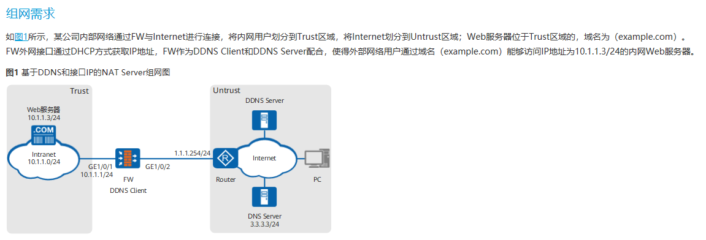
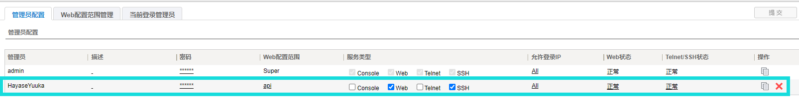
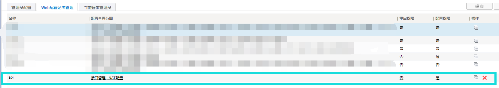

<p align="center"></p>
<h1 align="center">YuukaChan-DPTECH</h1>
<h4 align="center">优香酱迪普 FW 系列设备管理小工具 | HayaseYuuka DPTech FW Series Device Management Tool</h4><hr/>

## 适用场景

- 迪普 FW 系列防火墙
- 版本号为 V100R004B01D011P02PATCH08 （理论上2019年及以后的版本都支持）
- 已经使能 SSH

FW 系列其它设备/版本号理论上不会区别太大，应该也能支持，如果不能支持稍微改动一下应该就能用

开发/测试使用设备及版本：FW1000-GC-N V100R004B01D011P02PATCH08(S111C011D011P02PATCH08)

## 使用场景

### 场景介绍

下面介绍本工具的使用场景

此小工具目前只能在限定的使用场景发挥作用，并不能支持所有的管理功能，只能在以下场景使用（所以是“小工具”，2333）

使用场景同 [RESTCONF-YuukaChan](https://github.com/luckykeeper/RESTCONF-YuukaChan) ，只是设备换成了迪普的 FW ，另外要调整的项目从 NAT Server 变成了目的NAT，借用 RESTCONF-YuukaChan 的说明：

（使用场景类似 USG 产品文档 `CLI举例：公网用户通过DDNS和基于接口IP的NAT Server访问内部服务器` ，可供参考）

<details>   <summary>使用场景参考示意图(点击箭头展开/收合图片)</summary>   <p></p></details>

使用场景与上图略有不同，实际情况请参见以下表格

（概要：外网接口方式为 PPPOE 拨号动态获取 IP 地址，DDNS 服务使用阿里云 DDNS ，不在 FW 上配置 DDNS，出口有 ISP1 和 ISP2 两个，仅 ISP1 有公网）

| 项目                          | 数据                                                         | 说明                                                         |
| ----------------------------- | ------------------------------------------------------------ | ------------------------------------------------------------ |
| 接口号：GigabitEthernet 1/0/1 | IP地址：10.1.1.1/24<br/>安全区域：Trust                      | -                                                            |
| 接口号：GigabitEthernet 1/0/2 | IP地址：通过PPPOE方式获取（虚接口：ppp2）<br/>安全区域：Untrust1 | ISP1 线路                                                    |
| 接口号：GigabitEthernet 1/0/3 | IP地址：通过PPPOE方式获取<br/>安全区域：Untrust2             | ISP2 线路                                                    |
| NAT Server                    | 名称：policy_web(+端口号)<br/>公网地址：借用GigabitEthernet 1/0/2 （ISP1）接口地址<br/>私网地址：10.1.1.3<br/>公网端口：80，443（等多个）<br/>私网端口：80，443（等多个） | -                                                            |
| DDNS                          | 内部服务器通过 AliDDNS 更新                                  | 应配置该服务器只能从 ISP1 接口上网，防止获取到 IPS2 的公网 IP |
| Web服务器                     | 地址：10.1.1.3/24                                            | -                                                            |
| 路由                          | ISP1 ISP2 策略路由智能选路                                   | 不在本工具讨论范围内，略                                     |

### 配置思路

（仅涉及本工具相关问题，剩下内容不再涉及，请参考产品文档解决）

- 配置接口IP地址和安全区域，完成网络基本参数配置（略）
- 配置安全策略，允许外部网络用户访问内部服务器（略）
- **配置基于目的 NAT <- 本工具要解决的问题**
- 开启域名解析，配置DNS Server（略）
- 配置DDNS策略，并将其应用在 ppp2 接口上，使得外部用户通过域名（example.com）能够访问内网服务器（略）
- 在FW上配置缺省路由，使内网服务器对外提供的服务流量可以正常转发至ISP的路由器（略）

### 本工具要解决的问题

在配置基于目的 NAT Server 时，使用以下命令：（假设公网 IP 为 1.1.1.1）

```shell
1 <FW> conf
2 [FW] nat destination-nat test interface ppp2 global-address 1.1.1.1 service tcp 222 to 222 local-address 10.1.1.3 to 10.1.1.3 local-port 80
3 [FW] nat destination-nat test interface ppp2 global-address 1.1.1.1 service tcp 222 to 222 local-address 10.1.1.3 to 10.1.1.3 local-port 443
 …… # 映射其它同 IP 服务器上的更多端口命令
```

但是这里需要指定出口的 IP ，而使用动态公网 IP 的用户没有确定的公网 IP

**公网的 IP 地址不能确定，这会导致公网 IP 地址变动后外网用户无法访问在内网的服务器**

本工具通过调用设备的 SSH 获取指定接口当前 IP 地址，并将其填写到目的 NAT 的公网地址上，实现目的 NAT 的公网地址的动态更新

## 使用前的准备

### 配置思路

- 创建一个有 api 权限的账户（推荐，不推荐用管理员账户操作）
- 给定 api 账户的权限范围

### 配置参考

WEB -> 基本 -> 系统管理 -> 登录管理 -> 管理员 -> 管理员配置 ->新增管理员

新建一个 api 账户并给定 WEB 和 SSH 的权限

<details>   <summary>WEB-新建 API 用户示例(点击箭头展开/收合图片)</summary>   <p></p></details>

在配置范围管理内划定 api 用户的权限范围

<details>   <summary>WEB-划定API权限范围</summary>   <p></p></details>

通过终端调整 api 账户的权限，使其有提交权限，CLI 举例如下

```shell
<FW> conf
[FW] local-group api
[FW-api] submit-authority
```

## 使用说明

### 文件说明

- YuukaChan.py <- 优香酱，小工具运行文件，开发环境为 Python 3.9.8
- requirements.txt <- 依赖包 `pip install -r requirements.txt`
- YuukaChanTemplate.xls <- 设定模板文件，最好不要修改，程序运行不依赖该文件
- YuukaChan.xls <- 设定文件，相关参数填写在这里，程序运行依赖该文件

### 使用说明及提示

1. 完成 “[使用前的准备](##使用前的准备)” 一节的配置，设置好 api 账户
2. 在服务器上安装 Python3 ，pip 安装依赖库
3. 填写 `YuukaChan.xls` 文件，填写时注意文件内的说明
4. 运行（调试/生产环境）: `python .\YuukaChan.py runDebug |python .\YuukaChan.py runProd`

- 调用本工具会对设备上的当前设定信息做保存(write file)操作！
- 使用高强度的密码保护 api 账户
- 调试：`python .\YuukaChan.py runDebug` 是调试模式，另外还可以临时注释掉代码的 `try`(L94) 和 `except`(L424) 部分，更方便看报错信息
- 小工具目前实现了通过 SSH 的 `目的 NAT` 和 `组网配置` 功能，主要还是以实现自己的需求为主，想调其它接口可以参照源码自行实现，小工具通过 `DPTechFWShell_withoutPaging()` 方法实现了 SSH 下普通模式和特权模式的调用，也欢迎提交 PR ，新增更多功能

# 附录

就在这里发癫！

<p align="center"></p>

